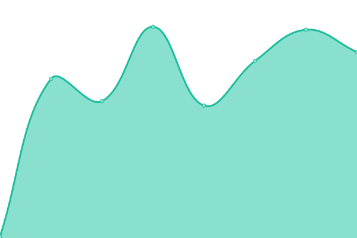

# [📈 Live Status](https://Studio-Arletti.github.io/uptime_monitor): <!--live status--> **🟧 Partial outage**

This repository contains the open-source uptime monitor and status page for [Studio-Arletti](https://Studio-Arletti.github.io/uptime_monitor), powered by [Upptime](https://github.com/upptime/upptime).

With [Upptime](https://upptime.js.org), you can get your own unlimited and free uptime monitor and status page, powered entirely by a GitHub repository. We use [Issues](https://github.com/Studio-Arletti/uptime_monitor/issues) as incident reports, [Actions](https://github.com/Studio-Arletti/uptime_monitor/actions) as uptime monitors, and [Pages](https://Studio-Arletti.github.io/uptime_monitor) for the status page.

<!--start: status pages-->
<!-- This summary is generated by Upptime (https://github.com/upptime/upptime) -->
<!-- Do not edit this manually, your changes will be overwritten -->
<!-- prettier-ignore -->
| URL | Status | History | Response Time | Uptime |
| --- | ------ | ------- | ------------- | ------ |
|  Atlasposting Gateway API | 🟩 Up | [atlasposting-gateway-api.yml](https://github.com/Studio-Arletti/uptime_monitor/commits/HEAD/history/atlasposting-gateway-api.yml) | 

 480ms
     
 | 

<a href="https://Studio-Arletti.github.io/uptime_monitor/history/atlasposting-gateway-api">100.00%</a>
    

|  Atlasposting Front end | 🟩 Up | [atlasposting-front-end.yml](https://github.com/Studio-Arletti/uptime_monitor/commits/HEAD/history/atlasposting-front-end.yml) | 

 113ms
     
 | 

<a href="https://Studio-Arletti.github.io/uptime_monitor/history/atlasposting-front-end">100.00%</a>
    

|  Atlasposting RISKMAPS service | 🟩 Up | [atlasposting-riskmaps-service.yml](https://github.com/Studio-Arletti/uptime_monitor/commits/HEAD/history/atlasposting-riskmaps-service.yml) | 

 410ms
     
 | 

<a href="https://Studio-Arletti.github.io/uptime_monitor/history/atlasposting-riskmaps-service">100.00%</a>
    

|  Atlasposting Nominatim maps service | 🟥 Down | [atlasposting-nominatim-maps-service.yml](https://github.com/Studio-Arletti/uptime_monitor/commits/HEAD/history/atlasposting-nominatim-maps-service.yml) | 

 707ms
     
 | 

<a href="https://Studio-Arletti.github.io/uptime_monitor/history/atlasposting-nominatim-maps-service">97.23%</a>
    

|  Changedetection Service | 🟩 Up | [changedetection-service.yml](https://github.com/Studio-Arletti/uptime_monitor/commits/HEAD/history/changedetection-service.yml) | 

 118ms
     
 | 

<a href="https://Studio-Arletti.github.io/uptime_monitor/history/changedetection-service">100.00%</a>
    

|  Browserless Service | 🟩 Up | [browserless-service.yml](https://github.com/Studio-Arletti/uptime_monitor/commits/HEAD/history/browserless-service.yml) | 

 113ms
     
 | 

<a href="https://Studio-Arletti.github.io/uptime_monitor/history/browserless-service">100.00%</a>
    

|  Weblate translation app | 🟥 Down | [weblate-translation-app.yml](https://github.com/Studio-Arletti/uptime_monitor/commits/HEAD/history/weblate-translation-app.yml) | 

 468ms
     
 | 

<a href="https://Studio-Arletti.github.io/uptime_monitor/history/weblate-translation-app">0.00%</a>
    

|  Atlasposting Develop API | 🟩 Up | [atlasposting-develop-api.yml](https://github.com/Studio-Arletti/uptime_monitor/commits/HEAD/history/atlasposting-develop-api.yml) | 

 380ms
     
 | 

<a href="https://Studio-Arletti.github.io/uptime_monitor/history/atlasposting-develop-api">100.00%</a>
    

|  posting (Legacy) | 🟩 Up | [posting-legacy.yml](https://github.com/Studio-Arletti/uptime_monitor/commits/HEAD/history/posting-legacy.yml) | 

 579ms
     
 | 

<a href="https://Studio-Arletti.github.io/uptime_monitor/history/posting-legacy">100.00%</a>
    

|  [Arletti&Partners](https://arlettipartners.com/) | 🟩 Up | [arletti-and-partners.yml](https://github.com/Studio-Arletti/uptime_monitor/commits/HEAD/history/arletti-and-partners.yml) | 

 377ms
     
 | 

<a href="https://Studio-Arletti.github.io/uptime_monitor/history/arletti-and-partners">100.00%</a>
    

|  AEPCLOUD | 🟩 Up | [aepcloud.yml](https://github.com/Studio-Arletti/uptime_monitor/commits/HEAD/history/aepcloud.yml) | 

 1049ms
     
 | 

<a href="https://Studio-Arletti.github.io/uptime_monitor/history/aepcloud">100.00%</a>
    

|  A&P DATA | 🟩 Up | [a-and-p-data.yml](https://github.com/Studio-Arletti/uptime_monitor/commits/HEAD/history/a-and-p-data.yml) | 

 720ms
     
 | 

<a href="https://Studio-Arletti.github.io/uptime_monitor/history/a-and-p-data">99.59%</a>
    

<!--end: status pages-->

[**Visit our status website →**](https://Studio-Arletti.github.io/uptime_monitor)

## 📄 License

- Powered by: [Upptime](https://github.com/upptime/upptime)
- Code: [MIT](./LICENSE) © [Anand Chowdhary](https://anandchowdhary.com), supported by [Pabio](https://pabio.com)
- Data in the `./history` directory: [Open Database License](https://opendatacommons.org/licenses/odbl/1-0/)
